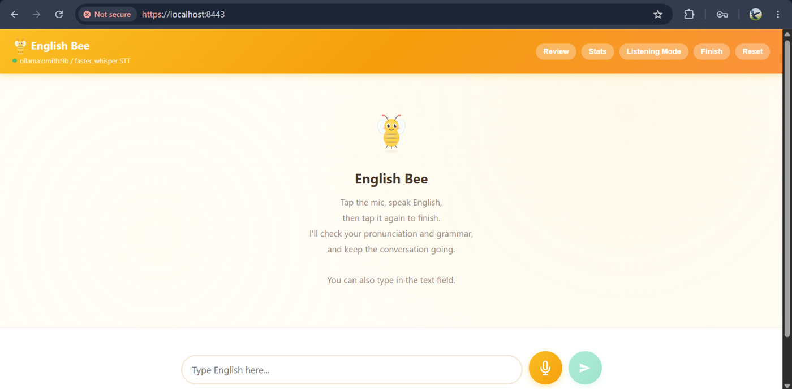
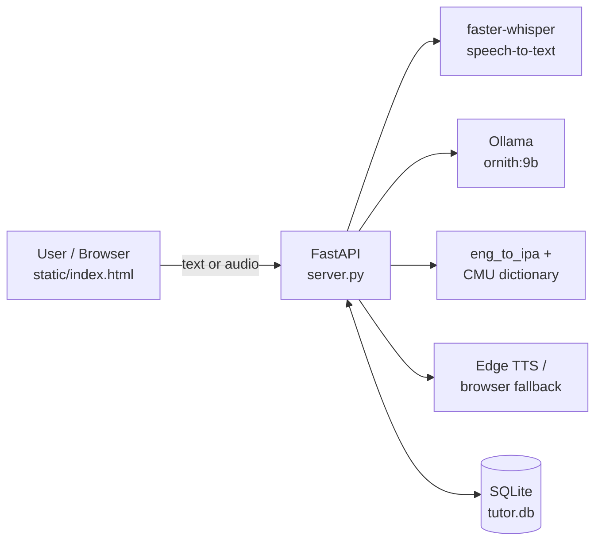

# AI English Conversation Tutor (English Bee)

An AI-powered English practice application that runs on your own computer. Chat by typing or speaking, get grammar corrections and more natural phrasing, see an IPA pronunciation reference, review your past mistakes, and track your weak areas — all stored locally in SQLite.


-black)

<p align="center">
  
</p>

## Table of Contents

- [Features](#features)
- [Screenshots](#screenshots)
- [How It Works](#how-it-works)
- [Tech Stack](#tech-stack)
- [Getting Started](#getting-started)
- [Configuration](#configuration)
- [API Endpoints](#api-endpoints)
- [Database](#database)
- [Project Structure](#project-structure)
- [Testing](#testing)
- [Important Notes and Limitations](#important-notes-and-limitations)
- [Roadmap](#roadmap)
- [Author](#author)
- [Acknowledgements](#acknowledgements)

## Features

- **Text conversation** with an AI tutor that replies in short, simple English.
- **Voice conversation** — record speech in the browser and have it transcribed by `faster-whisper`.
- **Grammar correction** with an explanation for every mistake.
- **Natural expression suggestions** — a more natural version of your sentence.
- **IPA pronunciation support** — an IPA reference line for the words you wrote or said.
- **Speech playback** using Edge TTS, with the browser's speech synthesis as a fallback.
- **Review mode** — practise your stored corrections with simple spaced-repetition intervals.
- **Learning statistics** — see your error types and recent speech-recognition confidence.
- **Conversation summary** at the end of a session.
- **Configurable providers** — Ollama by default; OpenAI and Anthropic are optional.

## Screenshots

| Text conversation with IPA | Grammar correction and natural expression |
|:---:|:---:|
|  |  |

| Voice recording | Voice transcription |
|:---:|:---:|
|  |  |

| Speech recognition confidence | Review mode |
|:---:|:---:|
|  |  |

| Weakness dashboard |
|:---:|
|  |

## How It Works



**Text flow:** the browser sends the message and a session ID to `POST /api/chat`. The backend loads recent turns, builds the prompt, calls the LLM, parses the structured reply, adds IPA and confidence data, saves the turn and its corrections, and returns JSON to the page.

**Voice flow:** the browser records audio with `MediaRecorder` and uploads it to `POST /api/transcribe`. `faster-whisper` returns the text and word probabilities, and the same chat flow follows. The average word probability is shown as *Speech Recognition Confidence*.

## Tech Stack

| Area | Technology |
|---|---|
| Backend | Python, FastAPI, Uvicorn |
| Frontend | HTML, CSS, vanilla JavaScript (single page) |
| Database | SQLite (`sqlite3`) |
| LLM | Ollama with `ornith:9b` (optional: OpenAI, Anthropic) |
| Speech-to-text | `faster-whisper` (optional: OpenAI) |
| Text-to-speech | `edge-tts` (optional: OpenAI), browser SpeechSynthesis fallback |
| Pronunciation text | `eng_to_ipa`, NLTK CMU dictionary |
| Local HTTPS | `cryptography` (self-signed certificate) |
| Testing | `pytest`, FastAPI `TestClient` |

## Getting Started

### Prerequisites

- Python 3
- [Ollama](https://ollama.com) installed and running
- A modern browser with microphone support (for example Google Chrome)
- Internet access for Edge TTS and for the first download of speech and dictionary resources

### Installation

```bash
# 1. Clone the repository
git clone https://github.com/NADIR789259/ai-english-conversation-tutor.git
cd ai-english-conversation-tutor

# 2. Create and activate a virtual environment
python -m venv .venv
# Windows
.venv\Scripts\activate
# macOS / Linux
source .venv/bin/activate

# 3. Install dependencies
pip install -r requirements.txt

# 4. Make the language model available in Ollama
ollama pull ornith:9b

# 5. Create your local configuration
cp .env.example .env        # Windows: copy .env.example .env
```

### Run

```bash
python server.py
```

You can also use `start.bat` (Windows) or `start.sh` (macOS / Linux). The server prints its access URLs when it starts. Open **https://localhost:8443** in your browser.

> The app generates a **self-signed certificate** for local use, so the browser will show a "Not secure" warning. This is expected. HTTPS (or localhost) is required for microphone access.

## Configuration

Settings are read from environment variables or an optional `.env` file. Environment variables already set in your system take precedence.

| Variable | Purpose |
|---|---|
| `LLM_PROVIDER` | `ollama` (default), `openai` or `anthropic` |
| `OLLAMA_BASE_URL`, `OLLAMA_MODEL` | Ollama address (default `http://localhost:11434`) and model tag |
| `OPENAI_API_KEY`, `OPENAI_MODEL` | OpenAI chat provider |
| `ANTHROPIC_API_KEY`, `ANTHROPIC_MODEL` | Anthropic chat provider |
| `STT_PROVIDER` | `faster_whisper` (default), `openai` or `disabled` |
| `FASTER_WHISPER_MODEL`, `FASTER_WHISPER_LANGUAGE` | Local transcription model and language |
| `FASTER_WHISPER_DEVICE`, `FASTER_WHISPER_COMPUTE_TYPE` | Runtime device and compute mode (`auto` is supported) |
| `TTS_PROVIDER` | `edge` (default), `openai` or `browser` |
| `EDGE_TTS_VOICE`, `EDGE_TTS_RATE` | Edge TTS voice and speaking rate |
| `OPENAI_TTS_MODEL`, `OPENAI_TTS_VOICE` | OpenAI speech settings |

Example `.env`:

```env
LLM_PROVIDER=ollama
OLLAMA_MODEL=ornith:9b
STT_PROVIDER=faster_whisper
FASTER_WHISPER_MODEL=base.en
TTS_PROVIDER=edge
```

> Never commit your real `.env` file or API keys. `.env`, certificates and the database are already listed in `.gitignore`.

## API Endpoints

| Method | Route | Description |
|---|---|---|
| GET | `/` | Serves the single-page interface |
| POST | `/api/chat` | Tutor reply, corrections, natural expression, IPA; saves the turn |
| POST | `/api/transcribe` | Transcribes an uploaded audio file (up to 25 MiB) |
| POST | `/api/pronunciation` | Returns IPA data for given text |
| POST | `/api/tts` | Returns MP3 speech for text (up to 1,000 characters) |
| GET | `/api/sessions` | Lists recent sessions |
| GET | `/api/corrections` | Lists stored corrections |
| GET | `/api/review/due` | Corrections that are due for review |
| POST | `/api/review/answer` | Checks a review answer and updates the schedule |
| GET | `/api/stats` | Totals, error categories and confidence values |
| GET | `/api/summary/{session_id}` | Session summary and learning feedback |
| GET | `/api/health` | Provider names and readiness flags |
| GET | `/api/models` | Lists available models from the provider |

Interactive API documentation is available at `/docs` (FastAPI's built-in Swagger UI) while the server is running.

## Database

The app uses a local SQLite file (`tutor.db`) with three tables:

```text
sessions (id PK, created_at)
   └── turns (id PK, session_id FK, user_text, reply, natural_expression,
              encouragement, pronunciation_score, recognition_confidence, created_at)
          └── corrections (id PK, turn_id FK, original, corrected, explanation,
                           error_type, review_count, correct_streak,
                           next_review_at, last_reviewed_at)
```

Each correction is tagged by `error_tagger.py` with a type such as `tense`, `article`, `preposition`, `word_order`, `subject_verb`, `plural`, `vocabulary`, `spelling` or `other`.

## Project Structure

```text
.
├── config.py                 # Settings and tutor system prompt
├── db.py                     # SQLite schema and queries
├── error_tagger.py           # Rule-based error type tagging
├── review_logic.py           # Review answer comparison
├── server.py                 # FastAPI app, routes, provider adapters
├── static/
│   ├── bee.svg
│   └── index.html            # Single-page frontend
├── docs/screenshots/         # Images used in this README
├── test_speech_confidence.py
├── test_summary.py
├── requirements.txt
├── .env.example
├── start.bat
├── start.sh
└── LICENSE
```

## Testing

```bash
python test_summary.py
pytest
```

The tests cover the speech-confidence calculation and the session-summary database, parser and API paths. The summary tests use a temporary database and a mocked LLM, so they do not need Ollama to be running.

## Important Notes and Limitations

- **Speech Recognition Confidence is not pronunciation accuracy.** It is the average word probability reported by the speech-to-text model. Some API fields still use the older name `pronunciation_score`.
- **IPA is a pronunciation reference.** It is looked up from the text. The app does not score phonemes, accent, stress or rhythm.
- **Correction quality depends on the model.** The LLM is instructed by a prompt; its output is not guaranteed to be complete or perfect. Error tagging is rule-based and approximate.
- **Not fully offline.** The LLM and speech recognition run locally, but Edge TTS and first-time downloads need internet.
- **Single-user, local tool.** There are no user accounts, and CORS is permissive. Add authentication and restrict CORS before exposing it publicly.
- **Sessions are not restored after a page reload.** Resetting only clears the screen; stored data stays in SQLite.

## Roadmap

- [ ] User accounts and per-user data
- [ ] Session list, delete and export in the interface
- [ ] Topic and difficulty selection
- [ ] Progress charts and weekly reports
- [ ] Audio-based pronunciation assessment (separate from ASR confidence)
- [ ] Mobile client
- [ ] More automated tests, including provider connectivity checks

## Author

**Nadir Khan**
Diploma in Computer Engineering, Ch. Bansi Lal Government Polytechnic, Bhiwani
GitHub: [@NADIR789259](https://github.com/NADIR789259)

## License

See the [LICENSE](LICENSE) file for details.

## Acknowledgements

[FastAPI](https://fastapi.tiangolo.com), [Ollama](https://ollama.com), [faster-whisper](https://github.com/SYSTRAN/faster-whisper), [edge-tts](https://pypi.org/project/edge-tts), [eng-to-ipa](https://pypi.org/project/eng-to-ipa) and [NLTK](https://www.nltk.org).
